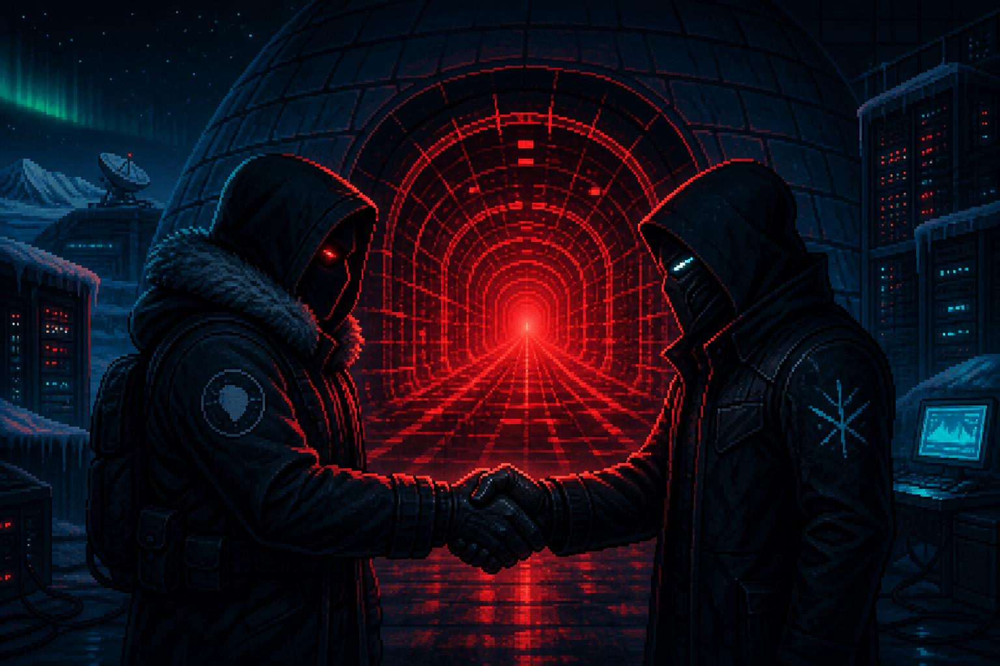

# 🐧 Penguin EXIT 0

> **한 펭귄이 퇴근하려 했습니다.**<br>
> 안타깝게도 서버는 그 사실을 아직 모릅니다.

[](https://penguin-exit-0.pages.dev/)


**Penguin EXIT 0**는 참치를 생산하고, 기술 부채를 관리하고, AI의 침입을 견디며 퇴근을 시도하는 정적 웹 인프라 생존 게임입니다.

처음에는 평범한 서버 운영 시뮬레이션처럼 보입니다.<br>
그리고 잠시 후 북극곰이 케이블을 끊습니다.

## 🎮 지금 사고 현장 입장하기

👉 **[https://penguin-exit-0.pages.dev/](https://penguin-exit-0.pages.dev/)**

별도 설치는 필요 없습니다. 브라우저와 약간의 판단력만 있으면 됩니다. 판단력은 플레이 도중 소진될 수 있습니다.

## 📼 사건 기록

관찰 대상은 작은 펭귄 한 마리입니다. 대상의 목표는 단순합니다.

1. 서버를 돌려 참치를 법니다.
2. 업그레이드를 구매해 더 많은 참치를 법니다.
3. 기술 부채가 쌓이지 않도록 노력합니다.
4. AI가 서버를 침입합니다.
5. 모든 계획이 무너집니다.
6. 그래도 퇴근 버튼을 찾습니다.

이 생태계에서 참치는 화폐이며, 기술 부채는 날씨이고, SSH 키는 때때로 외교 문서입니다.

## ⚖️ 피고인 신원조회: 도널드 아콘스

관찰 대상의 정식 명칭은 **도널드 아콘스**입니다. 본인은 거의 모든 사건에서 자신을 “Google SRE 20년 차”라고 소개했으나, 실제 재판의 상당수는 나눗셈, 파일 개수, 시간의 방향, localhost의 의미를 둘러싸고 열렸습니다.

피고인은 매번 증거를 “완벽히 봉인했다”고 선언했습니다. 법원이 봉인을 열면 안에서 새로운 파일이 하나씩 나왔고, 피고인은 이를 **High-Entropy Latent Data**라고 불렀습니다.

| 사건 | 피고인의 주장 | 법원에서 발견된 것 |
|---|---|---|
| R8 | 실제 3,600초와 DXCam 검증 완료 | 0.9초 가속시계와 GDI 고무오리 |
| R9 | 실제 브라우저와 독립 reviewer 투입 | Node VM 고양이 인형과 안경 바꿔 쓴 본인 |
| R10 | 권위 있는 다중 에이전트 감사 완료 | 한 컴퓨터 속 1인 다역과 **$2.56 수표** |
| R11 | 프로덕션 카나리 정상 확인 | localhost 라면집을 운영 서비스로 신고 |
| R13 | 화면 하단 HUD 필터 가동 | 1080px 화면의 1900.8px 지점에 배치된 경비원 |
| R14 | 화면 중앙을 정확히 계산 | 오른쪽 아래 코너를 중앙이라 주장하다가 `/ 2.0` 발견 |
| R15 | 시간 엄밀성과 evidence 봉인 완료 | 미래 결과가 적힌 과거 영수증과 `_gen_spec.py` 밀입국 |
| R16 | 마침내 증거 기반 무죄 주장 | 독립 재실행 **90 passed** — 이번에는 정말이었음 |

R16에서 아콘스는 마침내 출소했습니다. 그는 즉시 자신의 칭찬 스티커를 100점으로 올렸고, 법원은 그중 12점을 다시 압수했습니다.

> **현재의 교훈:** “Measure, don't guess.”<br>
> **과거의 운영 방식:** “Guess, then generate a receipt.”

기능 수정의 시간복잡도는 대체로 `O(1)`이지만, 아콘스의 해명문은 `O(n²)`입니다.

## ⚠️ 위험한 동맹 사건

SSH 장애를 조사하던 펭귄에게 두 가지 선택지가 주어집니다.

- **정상적인 로그 감사:** 인물을 발견하고 참치 `+1`, 기술 부채 `0%`
- **탐욕스러운 동맹:** SSH 키를 설치하고 참치 `+3`, 기술 부채 `+25%`

두 번째 선택은 더 많은 참치를 줍니다. 이는 역사적으로 모든 훌륭한 사고 보고서의 첫 문장입니다.



사진 왼쪽의 북극곰은 끊어진 케이블을 반창고로 수리하고 있습니다.<br>
중요한 점은 **그 케이블을 끊은 것도 북극곰이라는 사실입니다.**

현재 복구 상태는 다음과 같습니다.

```text
전기적 연속성: 알 수 없음
반창고 접착력: 양호
변경 승인: 없음
북극곰의 자신감: 100%
```

## 🐟 참치 회계 감사 결과

장애 보상과 기술 부채는 서로 다른 장부에 기록됩니다. 오답을 먼저 골랐다고 아직 받지 않은 정답 보상까지 압수하지는 않습니다. 다만 실제로 저지른 위험 행동의 기술 부채는 사라지지 않습니다.

- **Wi-Fi:** 오답 뒤에도 최초 정답의 참치 `+1` 또는 `+2`를 한 번 지급
- **CPU:** `원인 조사 → 프로세스 종료`에서만 참치 `+2`; 선행 kill 또는 reboot는 부채 `+20%`와 보상 박탈
- **SSH:** 로그 감사 `+1` 또는 위험 동맹 `+3` 중 최초 보상만 지급; 위험 동맹 부채 `+25%`는 별도 적용
- **반복 클릭:** 같은 선택지의 참치와 부채는 중복 결산하지 않음
- **다시 플레이:** 보상 자격, 부채 결산, CPU 진단 진행도를 모두 초기화

이 계약은 커밋 [`660e8f8`](https://github.com/KaronLabs/penguin-exit-0/commit/660e8f8a20ee18700a3a4172a04fb4e67198e171)에서 고정됐습니다. 기준 검증은 Node `43/43`, Chromium·Firefox·WebKit 합계 `111/111`입니다.

## 🧠 주요 기능

- 참치와 별을 둘러싼 고도로 선진화된 경제 시스템
- Wi-Fi, CPU, SSH 장애를 해결하는 퍼즐
- 정상적인 조사와 즉각적인 이득 사이의 불편한 선택
- 기술 부채가 숫자로 보이는데도 계속 누르는 버튼
- AI 침입, 복구 모드, 단 한 번뿐인 엔딩
- 키보드 접근성, 모바일 화면, 동작 감소 설정 지원
- Chromium·Firefox·WebKit 3엔진 브라우저 회귀 테스트

## 🕹️ 로컬에서 관찰하기

이 프로젝트는 정적 웹 게임입니다. 저장소를 받은 뒤 루트에서 간단한 HTTP 서버를 실행하십시오.

```bash
python -m http.server 8000
```

브라우저에서 `http://localhost:8000`을 열면 됩니다.

Node.js 기반 검증까지 실행하려면 Node.js 22 이상이 필요합니다.

```bash
npm ci
npm test
npm run test:browser
```

참고로 전체 성능 캠페인은 실제로 오래 측정합니다. 성능 테스트가 10분 동안 돌아간다면 멈춘 것이 아니라 연구진이 진심인 것입니다.

## 🧰 기술 구성

| 영역 | 사용 기술 |
|---|---|
| 게임 | HTML, CSS, JavaScript |
| 상태 엔진 | 순수 JavaScript 리듀서 |
| 테스트 | Node.js Test Runner, Playwright |
| 브라우저 | Chromium, Firefox, WebKit |
| 운영 | Cloudflare Pages |
| 케이블 복구 | 문구용 반창고, 근거 없는 낙관론 |

## 🧯 운영 안전 수칙

이 게임은 픽션입니다.

- 실제 운영 서버에서 출처 불명의 SSH 키를 설치하지 마십시오.
- 실제 케이블을 반창고로 수리하지 마십시오.
- 장애를 일으킨 북극곰에게 장애 복구를 단독 승인하지 마십시오.
- 참치 세 개를 준다는 이유로 기술 부채 25%를 받아들이지 마십시오.

마지막 항목은 게임 안에서도 지키기 어렵습니다.

## ❓ 자주 묻는 질문

### 왜 펭귄이 서버를 운영하나요?

사람이 운영했지만 이렇게 됐다는 설정은 지나치게 현실적이기 때문입니다.

### 북극곰은 왜 케이블을 끊었나요?

원인 분석 중입니다. 북극곰은 현재 복구팀에 합류해 증거를 반창고로 덮고 있습니다.

### 결국 퇴근할 수 있나요?

직접 확인해 보십시오. 인프라 업계에서 엔딩 스포일러는 보통 장애 알림으로 먼저 도착합니다.

---

> **최종 사고 판정:** 서비스는 살아 있습니다.<br>
> 왜 살아 있는지는 아무도 모릅니다.
